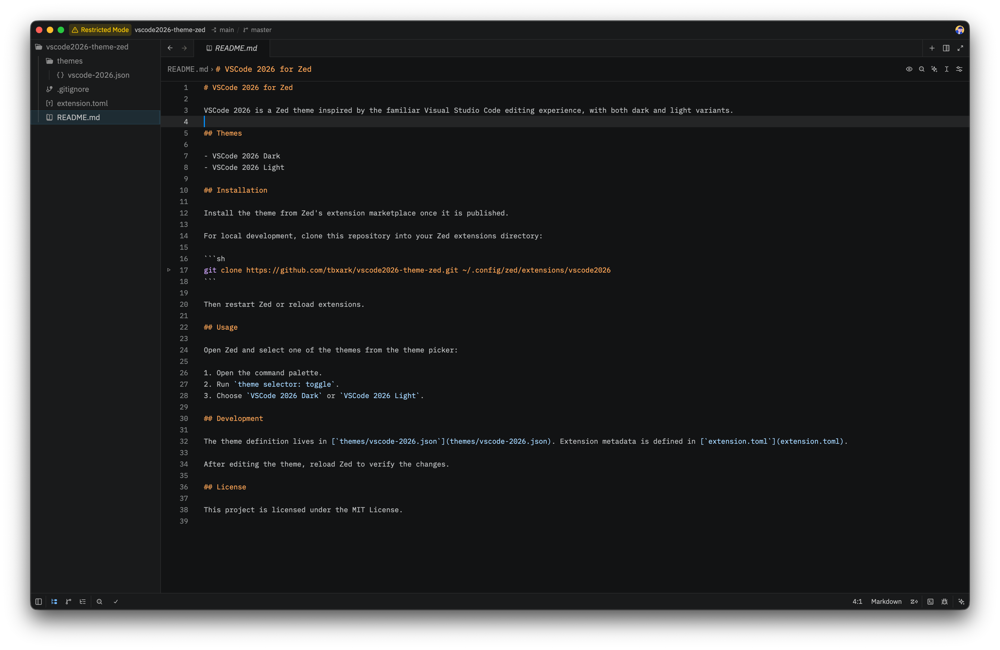

# VSCode 2026 for Zed

VSCode 2026 is a Zed theme inspired by the familiar Visual Studio Code editing experience, with both dark and light variants.



## Themes

- VSCode 2026 Dark
- VSCode 2026 Light

## Installation

Install the theme from Zed's extension marketplace once it is published.

For local development, clone this repository into your Zed extensions directory:

```sh
git clone https://github.com/tbxark/vscode2026-theme-zed.git ~/.config/zed/extensions/vscode2026-theme
```

Then restart Zed or reload extensions.

## Usage

Open Zed and select one of the themes from the theme picker:

1. Open the command palette.
2. Run `theme selector: toggle`.
3. Choose `VSCode 2026 Dark` or `VSCode 2026 Light`.

## Development

The theme definition lives in [`themes/vscode-2026.json`](themes/vscode-2026.json). Extension metadata is defined in [`extension.toml`](extension.toml).

After editing the theme, reload Zed to verify the changes.

## License

This project is licensed under the MIT License.
